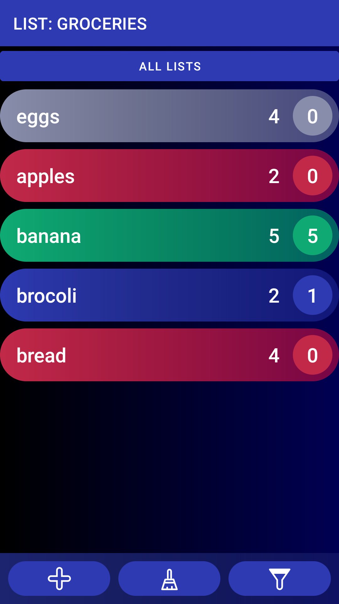
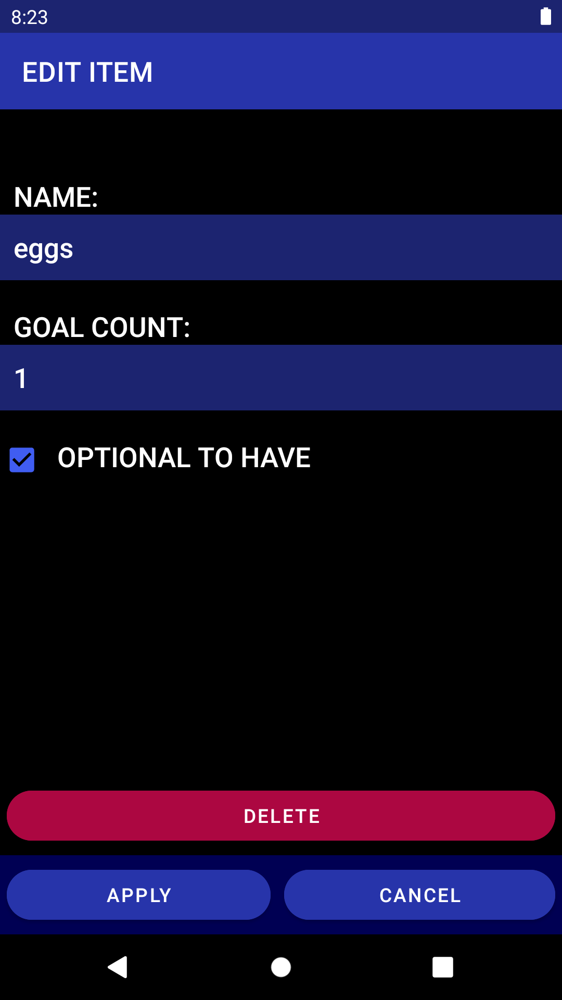
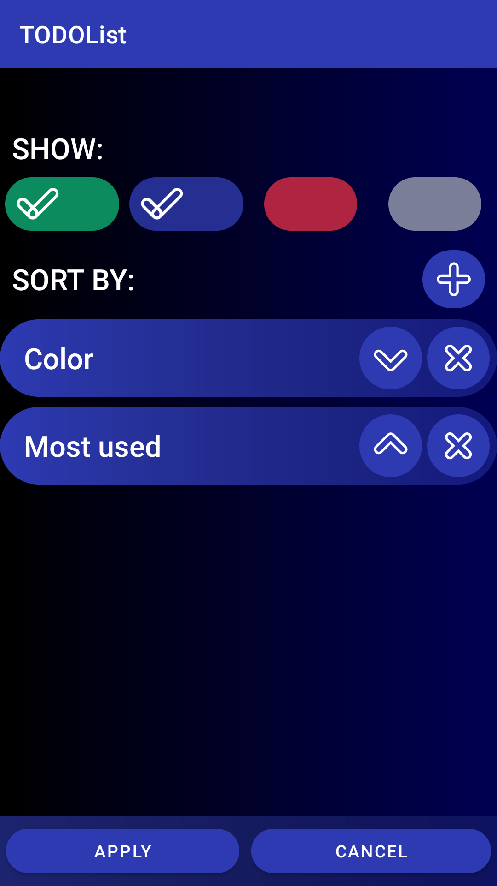

# TODO list

Android app for creating and organizing multiple todo lists.

Every item on a list has name, ideal/goal count and current count. Name is just a name you give the item. When your current count is same or higher than your ideal/goal count for the item then the item is showed as completed. You can use it for example as item in shopping list, score in a game, things to pack up or any other way you like.

## Features

- exporting list to a CSV file and importing CSV file to app
- visually differentiate empty, partially filled and fully filled items
- ability to set items to be OPTIONAL (when item is empty or partially filled it will be shown in much lower contrast)

## Privacy policy of the app

App doesn't collect any personal data. More on it [here](./Privacy%20Policy.md).